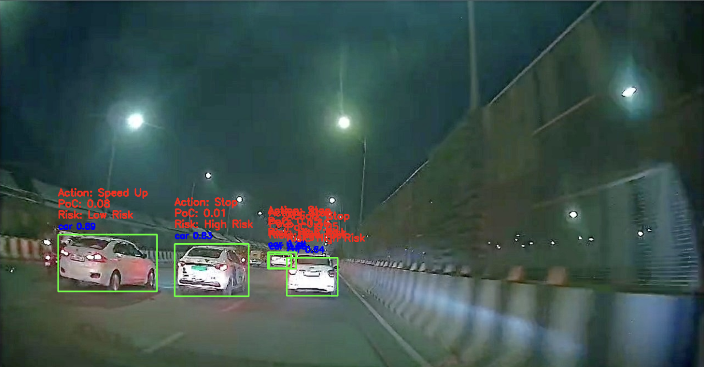

# Vision-In-Dark (VID) Framework

### Real-Time Vehicle Detection, Collision Risk Assessment & Driver Action Recommendation

The **VID Framework** is a computer vision based traffic-scene understanding system designed to analyze road footage and assist in safe driving decisions.
The system detects surrounding vehicles, estimates potential collision risk, and recommends an appropriate driver action such as **Stop** or **Speed Up**.

This project simulates a simplified perception module similar to those used in autonomous driving systems.

---

## Demo Output

Below is an example inference produced by the system:



The framework:

* detects multiple vehicles
* assigns confidence score
* evaluates proximity risk
* predicts driving action

---

## Problem Statement

Drivers often fail to judge safe following distance, especially at **night or low-visibility conditions**.
This system attempts to assist the driver by automatically monitoring nearby vehicles and warning about potential risk situations.

---

## System Pipeline (How it Works)

The framework follows a multi-stage perception pipeline:

### 1. Frame Acquisition

A video or image frame is taken as input from road footage.

### 2. Vehicle Detection (YOLO Model)

The system uses a pretrained **YOLO (You Only Look Once)** object detection model to detect vehicles in each frame.

YOLO is used because:

* real-time performance
* single pass detection
* high accuracy for traffic objects

The model identifies:

* cars
* nearby vehicles
* relative positions

Each detected vehicle is assigned:

* bounding box
* confidence score

---

### 3. Distance & Proximity Estimation

After detection, the framework estimates relative closeness of each detected vehicle using:

* bounding box size
* position in frame
* lane alignment

Larger bounding box → vehicle is closer.

---

### 4. Probability of Collision (PoC)

A custom logic module calculates **Probability of Collision (PoC)** based on:

* distance approximation
* number of nearby vehicles
* lane position
* closeness to center path

Higher PoC → greater accident possibility.

---

### 5. Risk Classification

The system categorizes each vehicle:

* **Low Risk** → Safe distance
* **High Risk** → Potential collision

---

### 6. Action Recommendation

Based on risk level:

| Risk Level | Recommended Action  |
| ---------- | ------------------- |
| Low Risk   | Speed Up / Maintain |
| High Risk  | Stop / Slow Down    |

This simulates a simplified Advanced Driver Assistance System (ADAS).

---

## Technologies Used

* Python
* OpenCV
* NumPy
* PyTorch
* YOLO Object Detection
* Computer Vision

---

## Project Structure

```
video-detection-framework/
│
├── VIDframework.ipynb
├── README.md
├── requirements.txt
├── .gitignore
├── results/
│     detection1.png
```

---

## Setup Instructions 

### Step 1 — Clone the repository

```
git clone https://github.com/yourusername/Vision-in-Dark.git
cd Vision-in-Dark
```

### Step 2 — Install dependencies

```
pip install -r requirements.txt
```

### Step 3 — Download pretrained model

Download the trained YOLO weights 

Place the file inside:

```
models/
```

### Step 4 — Run the project

```
jupyter notebook VIDframework.ipynb
```

Run all cells to see detection results.

---

## Applications

* Driver assistance systems
* Autonomous vehicle perception
* Smart traffic monitoring
* Accident prevention research

---

## Future Improvements

* Real-time video stream processing
* Lane detection integration
* Speed estimation
* Warning alert system
* Dashboard interface

---

## Author

Komal Baid
Computer Science Engineering Student
